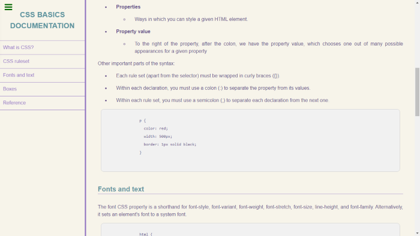

# Technical Document Page
## CSS Basics Documentation
A mock documentation page, covering the basics of CSS

<!-- PROJECT SHIELDS -->

<!-- PROJECT LOGO -->

 

  

  <h3 align="center"><strong>CSS3 Basics Technical Documentation Page
</strong></h3>

  

        HTML5 & CSS3 | Technical Documentation Page
     
    <a href="https://github.com/RachelNapier/technical-document-page"><strong>Explore the docs»</strong></a>
     
    <a href="https://rachelnapier.github.io/technical-document-page/">View Demo</a>
  

 
 

<!-- ABOUT -->

## <strong>About:</strong>

A fully responsive, mock, "CSS3 Basics Technical Documentation Page"

<strong>Desktop navigation version:</strong>

 
 

<strong>Mobile navigation version:</strong></
 

<!-- CONTRIBUTORS -->

## <strong>Contributors</strong>

Developed by: [Rachel Napier](https://github.com/RachelNapier) 
Resources from: [MDN Docs](https://developer.mozilla.org/en-US/docs/Web/CSS)
Testing: [FreeCodeCamp](https://www.freecodecamp.org) 

<!-- CONTACT -->

## <strong>Contact Me</strong>

LinkedIn: [Rachel Napier](https://www.linkedin.com/in/rachelnapierx) 
Twitter: [@RachelNapier93](https://twitter.com/RachelNapier93) 
Github: [RachelNapier](https://github.com/RachelNapier) 
Gmail: napier.rachel93@gmail.com

